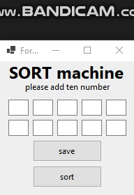

# 🔢 Number Sorter — My First Sorting Algorithm in C#  
A beginner-friendly Windows Forms app that sorts ten user-entered numbers  
Built as part of my hands-on journey into arrays, loops, and interactive UI design ✨  

## 💡 What it does  
Enter ten numbers into the form’s textboxes and click “Sort”—  
The app uses a nested loop to reorder them in ascending order!  
After sorting, click “Show” to re-display the sorted list back into the form.  

## 🎯 Why it matters  
This was my first exploration into array manipulation and sorting logic.  
It helped me understand how UI input connects to algorithmic computation.  

## 🔧 Technologies used  
💻 Language: C#  
🖥️ Framework: Windows Forms  
🛠️ Environment: Visual Studio  

## 📸 Demo  

## 📁 Download and Run  
To try the project:  
1. Clone this repository  
2. Open the `.sln` file in Visual Studio  
3. Press Start and interact with the form!  

## 🙋‍♀️ About Me  
I’m a computer engineering student with a creative spirit—  
I love blending logic and design to create interactive digital experiences 🌈✨  
